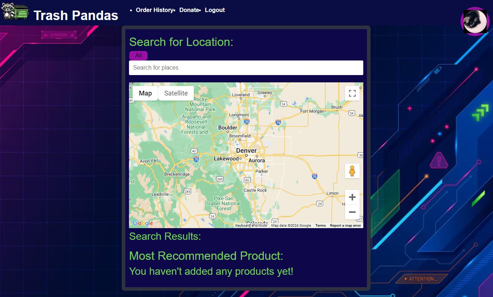

# Trash Pandas: A Mental Health Adventure

## Table of Contents
- [Description](#description)
- [User Story](#user-story)
- [Technologies Used](#technologies-used)
- [Screenshot](#screenshot)
- [Deployed Application](#deployed-application)

## Description
```
"Trash Pandas" is a mobile app designed to promote mental health improvement and emphasize the importance of self-care. The app provides tools and resources to assist individuals who tend to avoid social interactions, helping them to manage their mental well-being effectively. Through engaging content, supportive communities, and practical self-care tips, Trash Pandas aims to create a positive impact on users' mental health and overall quality of life.
```

## User Story
As a user, I want to motivate myself to go to social gathering places and make new friends. When I log in to my account I see my own Trash Panda Character. When I click on a location on my map I can say I have been there, and recieve experience points to level my character.

## Technologies Used
- Google Tile Overlays/Google Places?
- Stripe
- MongoDB/Mongoose
- GraphQL/Node.js/Express.js
- Render
- React

## Screenshot



## Deployed Application
https://mental-health-adventure.onrender.com/
